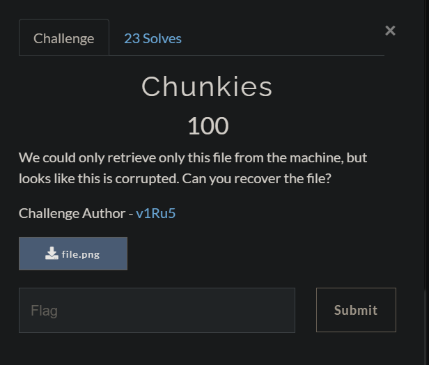
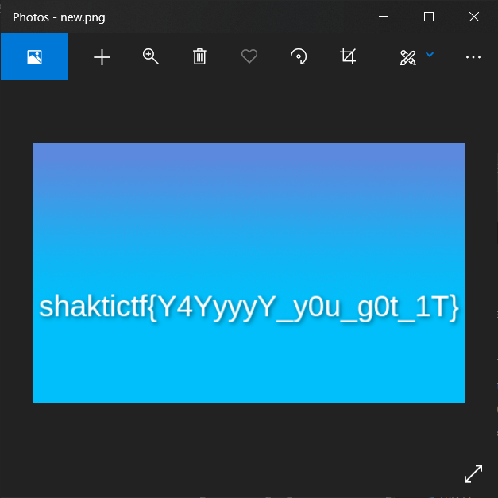

#### FILES

[file.png](./src/file.png)

---

#### (Solution) Chunkies

When we try opening the file there is an error.

Let's do the basic recon:

- ```
  file file.png
  file.png: data
  ```

- ```
  $ ls -la file.png
  -rwxrwxrwx 1 tracesofnuts tracesofnuts 45356 Apr  4 12:30 file.png
  ```

- ```
  $ exiftool file.png
  ExifTool Version Number         : 12.16
  File Name                       : file.png
  Directory                       : .
  File Size                       : 44 KiB
  File Modification Date/Time     : 2021:04:04 12:30:32+08:00
  File Access Date/Time           : 2021:04:04 12:54:34+08:00
  File Inode Change Date/Time     : 2021:04:04 12:32:20+08:00
  File Permissions                : rwxrwxrwx
  Error                           : File format error
  ```

Now, let's create a hexdump of the file and store it as a text file.

```
$ xxd file.png > hexdump.txt
```

From this, we can check the for the PNG file signatures:

- **Header signature** - Since it is a PNG file, it should have the following hex values at the start `89 50 4e 47`. However, the file starts without the `89`.
- **Footer signature** - It also should have the following footer signature: `49 45 4e 44 ae 42 60 82`. However, the signature ends with `49 4e 45 44 ae 42 60 82` instead.
- **Image data signature** - the image data should have the following signature: `49 44 41 54` but instead we got `49 41 44 54`. Also note that there may be multiple image data chunks. Using the 'find' feature of most text editors (ctrl+f), I found 6 instances of the corrupted image signature. I took down the line number and its index for processing later.

Let's modify the file. There are many ways to modify the file. Personally I am comfortable with using python and modifying strings directly.

```python
import binascii

with open("file.png","rb") as f:
    s = f.read().hex()

# IDAT typo locations as tuples given by (line number,offset)
idat = [(3,10), (516,2), (1028,26), (1541,18), (2054,10), (2567,2)]
index = []
for i in idat:
    temp = 32*(i[0]-1)+i[1]
    index.append(temp)

new =   '89'   + s[:index[0]] +             \	# correcting headers
        '4441' + s[index[0]+4:index[1]] +   \	# correcting idat1
        '4441' + s[index[1]+4:index[2]] +   \	# correcting idat2
        '4441' + s[index[2]+4:index[3]] +   \	# correcting idat3
        '4441' + s[index[3]+4:index[4]] +   \	# correcting idat4
        '4441' + s[index[4]+4:index[5]] +   \	# correcting idat5
        '4441' + s[index[5]+4:-16] +        \	# correcting idat6
        '49454e44ae426082'				\	# correcting end

result = binascii.a2b_hex(new)

with open("new.png","wb") as f:
    f.write(result)
```

The image prints the flag.



Flag:

```
shaktictf{Y4YyyyY_y0u_g0t_1T}
```

---

#### References

- https://www.usna.edu/Users/cs/wcbrown/courses/si110AY13S/lec/l31/lec.html

- https://en.wikipedia.org/wiki/Portable_Network_Graphics