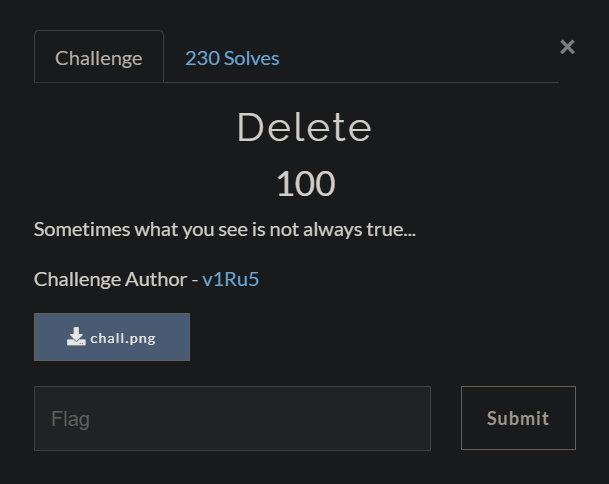

#### FILES

[chall.png](./src/chall.png)

---

#### Delete (Solution) 

When we try to open the file it seems like it is corrupted.

Let's do some basic recon to check.

```
$ file chall.png
chall.png: PNG image data, 264 x 191, 8-bit colormap, non-interlaced
```

```
$ ls -la chall.png
-rwxrwxrwx 1 tracesofnuts tracesofnuts 46335 Apr 10 10:31 chall.png
```

So far nothing out of the ordinary. Since it is an image file, we can use exiftool to reveal the metadata.

```
$ exiftool chall.png
ExifTool Version Number         : 12.16
File Name                       : chall.png
Directory                       : .
File Size                       : 45 KiB
File Modification Date/Time     : 2021:04:10 10:31:05+08:00
File Access Date/Time           : 2021:04:10 10:34:42+08:00
File Inode Change Date/Time     : 2021:04:10 10:32:43+08:00
File Permissions                : rwxrwxrwx
File Type                       : PNG
File Type Extension             : png
MIME Type                       : image/png
Image Width                     : 264
Image Height                    : 191
Bit Depth                       : 8
Color Type                      : Palette
Compression                     : Deflate/Inflate
Filter                          : Adaptive
Interlace                       : Noninterlaced
Palette                         : (Binary data 537 bytes, use -b option to extract)
Warning                         : Corrupted PNG image
Image Size                      : 264x191
Megapixels                      : 0.050
```

Indeed, the PNG image is corrupted.


Let's use `xxd` to create a hexdump of the file.

```
$ xxd chall.png > hexdump.txt
```

Let's check the headers and footers of the file.

A PNG file should have the following:

- header signature: `89 50 4e 47 0d 0a 1a 0a ` 
- footer signature: `49 45 4e 44 ae 42 60 82`
- an IHDR chunk
- one or more IDAT chunks

However, the file seem to contain 2 headers.

I am guessing that there may be deleted binary values based on the title of the challenge.

Flag:

```

```

---

#### References

- http://www.libpng.org/pub/png/spec/1.2/PNG-Chunks.html
