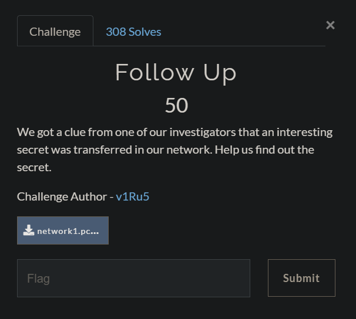
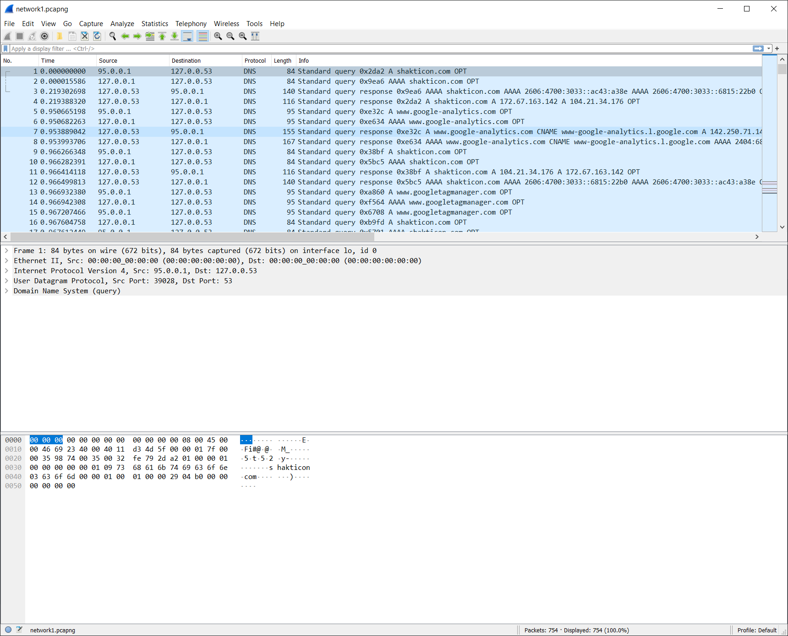
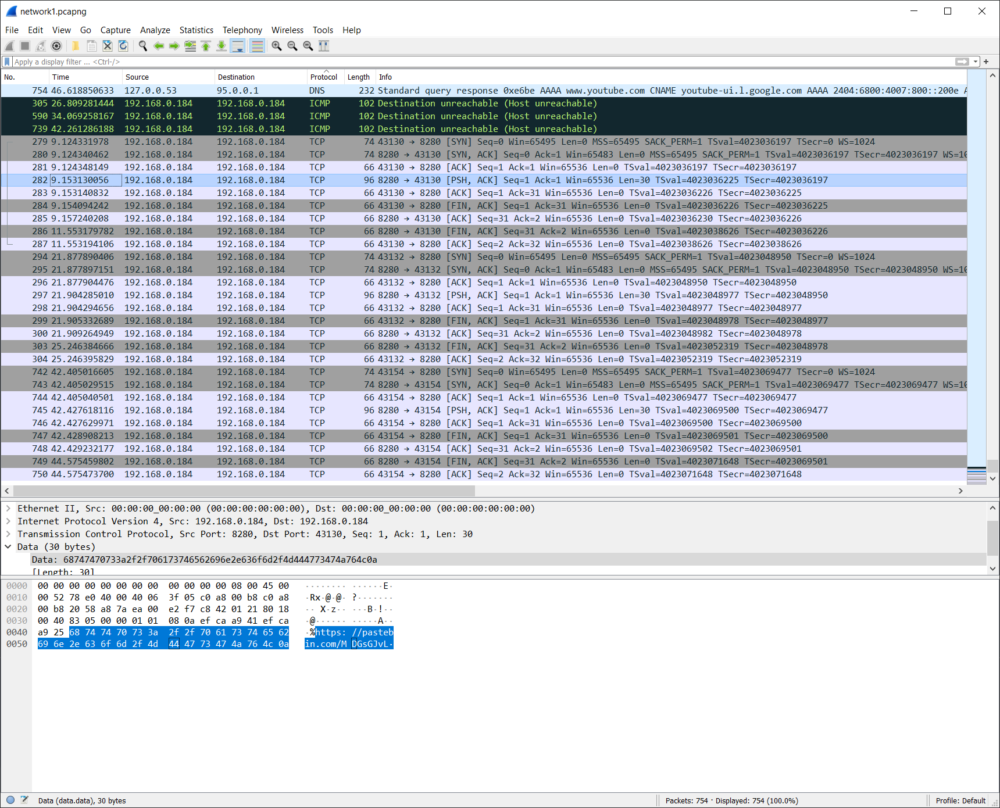

#### FILES

[network1.pcapng](./src/network1.pcapng)

---

#### Follow Up (Solution) 

The challenge provides a PCAP Next Generation (.pcapng) dump file. So let's use Wireshark to analyze.



The .pcapng file consists of captured data packets over some network. In the screenshot above we can see several DNS packets, even one with a query to shakticon.com.

When given a pcap/pcapng file, typically we would be more interested in the TCP or FTP protocol. So let's filter by protocol instead and take a look at the TCP packets.



Indeed, there are several TCP packets with 3 of the packets being of particular interest because each one of contains a pastebin link.

The packets and the pastebin links are listed below.

- 282 - https://pastebin.com/MDGsGJvL
- 297 - https://pastebin.com/CYyWFGVL
- 745 - https://pastebin.com/4NXGaVbA

The first 2 are fake flags. The real flag is in packet number 745.

Flag:

```
shaktictf{Th15_w4s_eA5Y!!}
```

---

#### References

- https://www.varonis.com/blog/how-to-use-wireshark/
